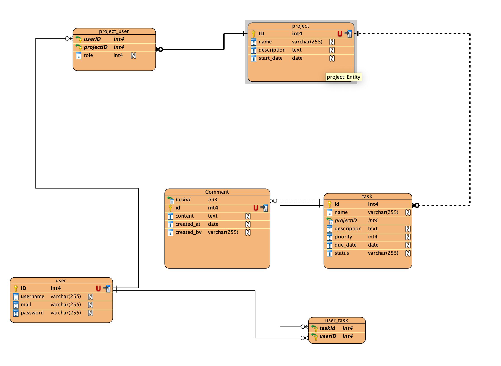
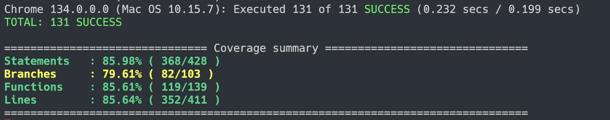
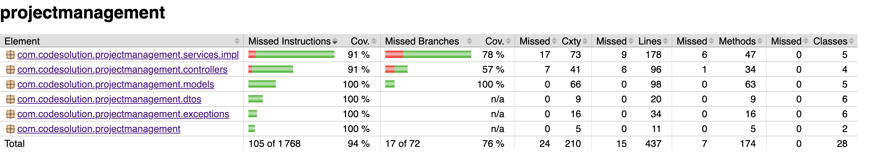

# Project Management Tool

## Conception

Pour la conception, un diagramme de base de données a été réalisé à l'aide de Visual Paradigm.



## Développement

Le développement a commencé par le backend, en réalisant 90% de celui-ci tout en testant les routes avec Insomnia pour s'assurer de leur cohérence.

Ensuite, le frontend a été développé avec des connexions progressives au backend, corrigeant les erreurs et ajustant les routes au besoin. La sécurité n'étant pas une priorité, l'identifiant de l'utilisateur est stocké dans le stockage du navigateur. Pour un déploiement en production, l'utilisation d'un système de tokens JWT serait recommandée.

Le développement a été initialement réalisé avec une base de données H2, puis migré vers PostgreSQL pour le déploiement. Les notifications par mail ont été gérées via Mailtrap après des essais infructueux avec Gmail et Yahoo.

## Tests

Les tests ont été menés en se basant sur le rapport de couverture pour garantir un coverage minimum de 60% pour les instructions et les branches.


## Industrialisation

Un pipeline CI/CD a été mis en place avec GitHub Actions. À chaque commit, les tests unitaires du frontend et du backend sont exécutés. Si les tests réussissent, deux images Docker sont créées à partir des Dockerfiles présents dans les dossiers `front` et `back`, puis poussées sur Docker Hub.

## Instructions pour l'Exécution

### Prérequis

-  Docker et Docker Compose installés

### Exécution avec Docker Compose

```bash
docker-compose up --build
